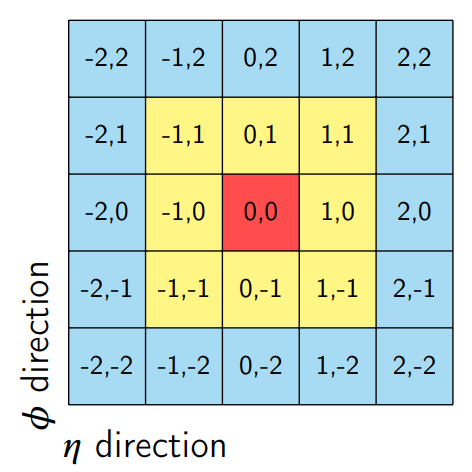
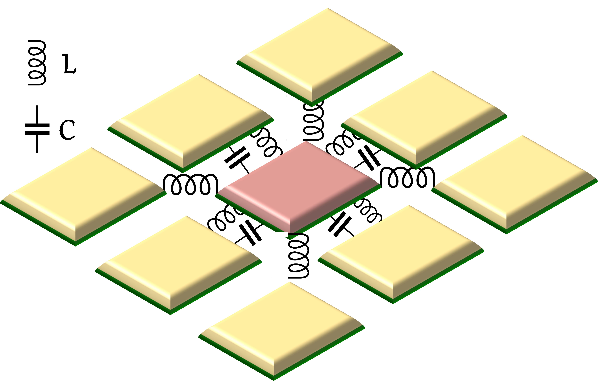

This repository was created to share the code and dataset used to produce the results in the paper "Crosstalk Mitigation in an ATLAS-like High Energy Liquid Argon
2 Calorimeter using Artificial Neural Networks", submitted to NIMA-D.

# crosstalk in Liquid Argon Calorimeter
This codes is a module 

- Function to generate the g(t) signal in an LAr calorimeter cell.
-     cellFunction(t): t is the sampling time desired
- Function to generate the capacitive crosstalk (XT) signal for a neighbor cell.
-      XTalk(t): t is the sampling time desired
- Functions to plot histograms to compare distributions.
-      plotHisto
-  The notebook below shows a example of 
-     generateSignals.ipynb

  
  
  

