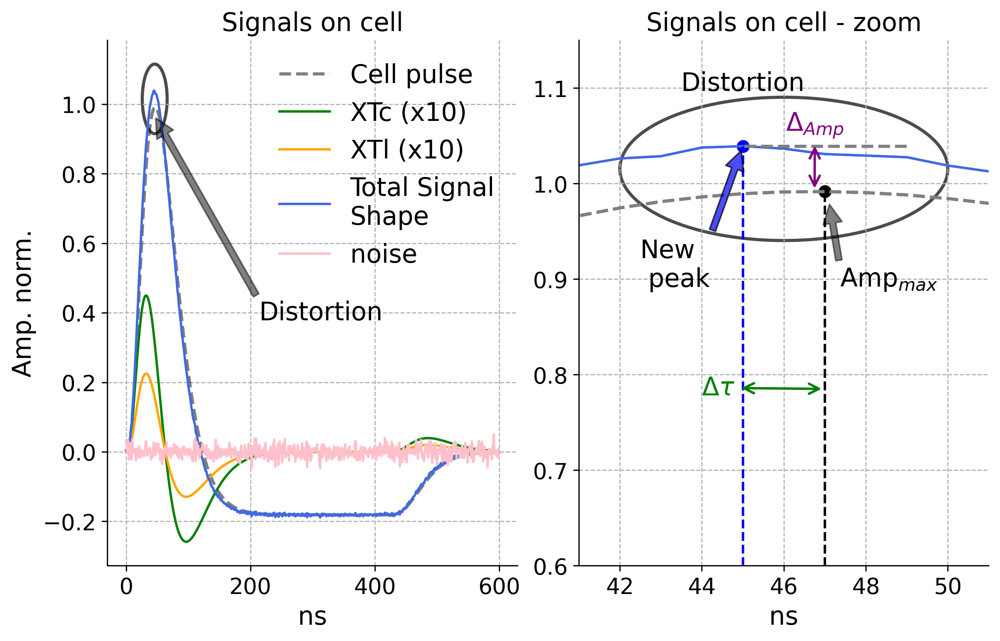
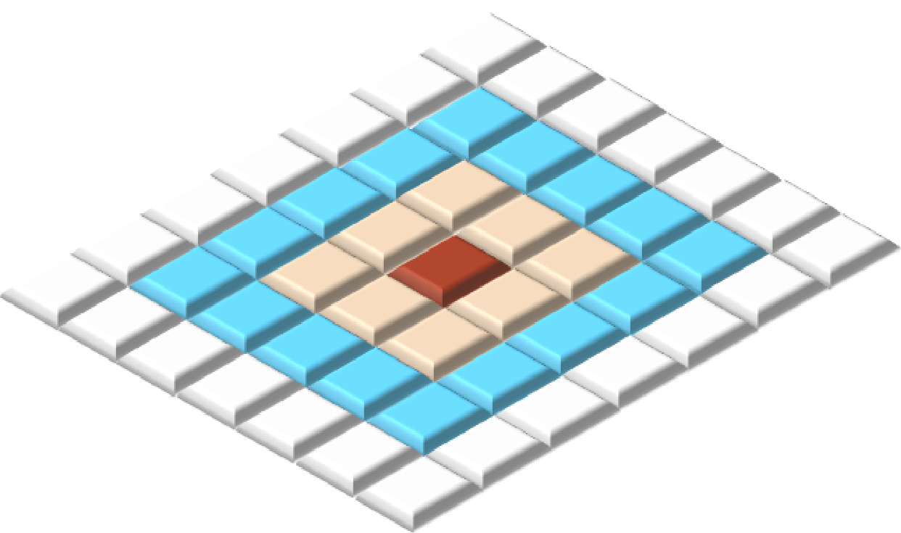

This repository was created to share the code and dataset used to produce the results in the paper "Crosstalk Mitigation in an ATLAS-like  High Energy Liquid Argon Calorimeter using Artificial Neural Networks", submitted to NIMA.

# Crosstalk (XT) in a Liquid Argon Calorimeter (LAr)

Crosstalk is a well-known issue in electronic circuits. In Liquid Argon (LAr) calorimeters, the high granularity of sensor cells and the high particle energies can produce parasitic effects that distort the signal of interest. One such effect is crosstalk (XT), a spurious signal induced by neighboring cells.

  <b>Fig. 1.</b> Cell signals - At left, cell signal, XT L, and C, and noise contribution. At right the details for distortion caused by XT.

<table align="center">
  <tr>
    <td align="center">
       
    </td>
  </tr>
</table>

This module is based on particle physics models and is designed to compute inductive and capacitive crosstalk contributions within a cluster cell of a Liquid Argon Calorimeter. It is part of the [Lorenzetti](https://github.com/lorenzetti-ufrj-br/lorenzetti) framework for high-energy physics studies.

(a) Standard cluster used for energy and time estimation. (b) Cell addressing scheme used in this module, where the red cell is the hottest cell and the yellow cells represent first neighbors, corresponding to first-order crosstalk. (c) Inductive (L) and capacitive (C) coupling in the cell of interest.

  <b>Fig. 2.</b> (a) Standard Cluster, (b) cluster addressing scheme, and (c) LC coupling.

<table align="center">
  <tr>
    <td align="center">
       
      <b>(a)</b> 
    </td>
    <td align="center">
       
      <b>(b)</b> 
    </td>
    <td align="center">
       
      <b>(c)</b> 
    </td>
  </tr>
</table>

This repository contains a peace of samples, on clusters path, produced in the Lorrenzetti framework.

- Function to generate the g(t) signal in an LAr calorimeter cell.
-     cellFunction(t): t is the sampling time desired
- Function to generate the capacitive crosstalk (XT) signal for a neighbor cell.
-      XTalk(t): t is the sampling time desired
- Functions to plot histograms to compare distributions.
-      plotHisto
-  The notebook below shows a example of 
-     generateSignals.ipynb
